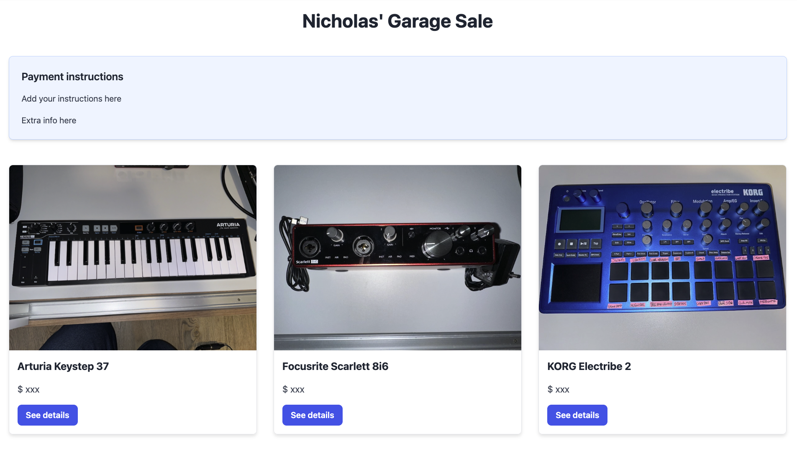

# 🏷️ Garage sale app

Simple garage sale app that I built using Nuxt. Nuxt Content made managing the content (via `/content/products/*` Markdown files) a breeze!

The app includes a show page per item with an image gallery.



## Setup

Make sure to install dependencies:

```bash
yarn install
```

## Development Server

Start the development server on `http://localhost:3000`:

```bash
yarn dev
```

## Production

Build the application for production:

```bash
yarn build
```

Locally preview production build:

```bash
yarn preview
```

Check out the [deployment documentation](https://nuxt.com/docs/getting-started/deployment) for more information.
